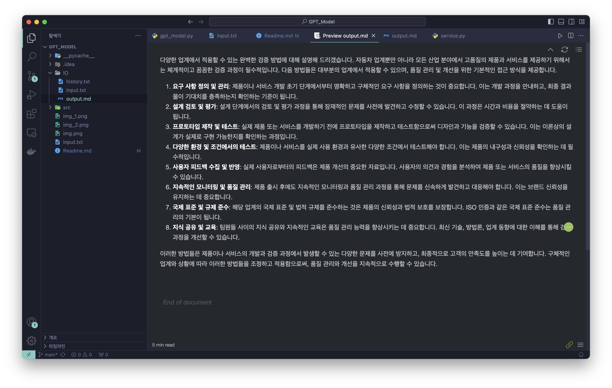
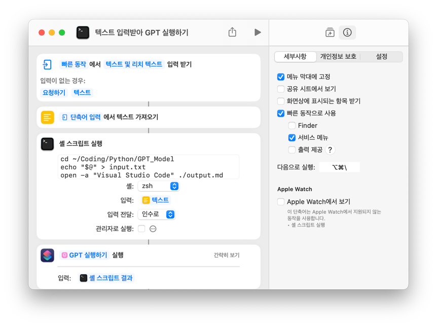
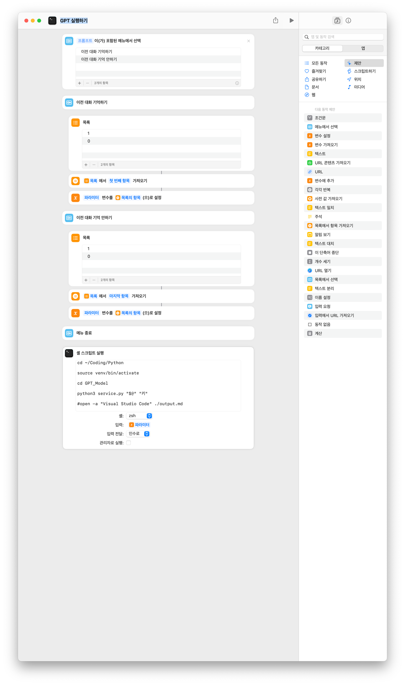

MAC OS의 단축어 기능을 통해 GPT API 사용하기
=====================================

왜 만들었는지? 
-
- 챗지피티는 3만원, 뤼튼은 너무 느려 --> 내가 한번 싸게싸게 만들어보자 
- 맥북도 있겠다 자동화 시도 

## 기능
- gpt4-turbo-preview 사용가능
- 이전 대화 저장  
- 영어 번역
- 한국어 번역

## 준비물 
    OPENAI_API_KEY -> openai가서 키 받으세요. 결제도 하세요
    pip로 openai 설치
    
    Mac의 단축어 

## 프로젝트 파일 사용법
    cd ~/Coding/Python
    git clone  https://github.com/sangho007/GPT_Model.git
    
    cd GPT_MODEL
    
    python3 service.py "0 아님 1" "openai_key"
    ex) python3 service.py "0" "asdf"

    output.md에 결과물이 저장됩니다
    
    기본적으로 텍스트를 입력하거나 드래그한 경우 이 메뉴가 활성화 됩니다. 

    인수로 0 준 경우 : 이전 대화 기억 안하기 
    인수로 1 준 경우 : 이전 대화 기억 하기 
    인수로 2 준 경우 : 영어로 번역하기  
    인수로 3 준 경우 : 한국어로 번역하기  

-------------
## 단축어 
- 아래 사진은 번역 기능이 빠져있고 프로젝트 구조가 약간 다릅니다. 경로에 맞춰서 스크립트 수정해주세요

